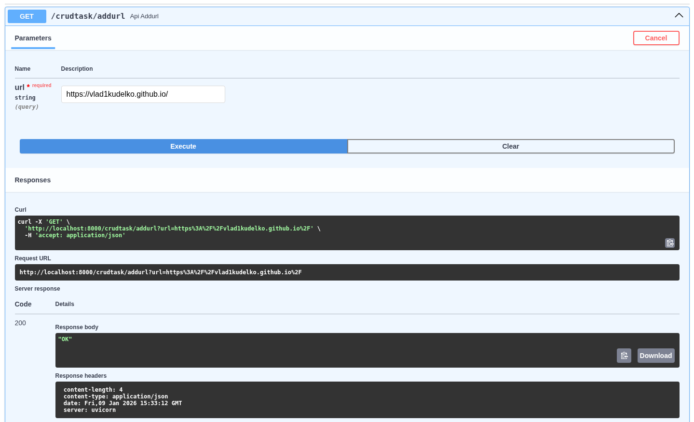
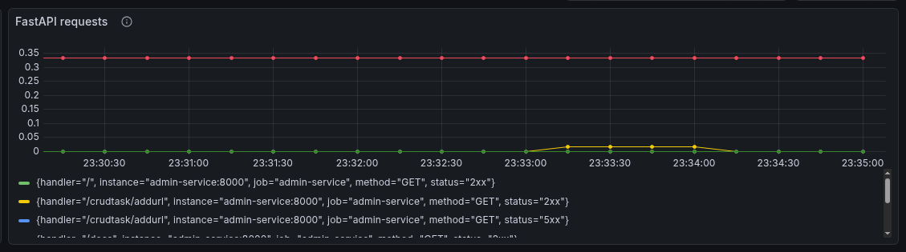
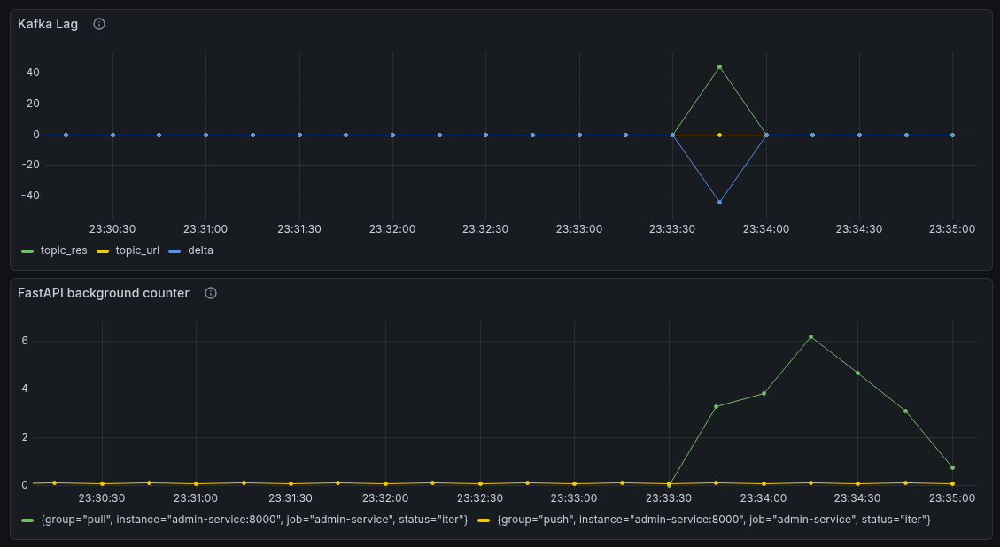

# Open Ahrefs

Масштабируемая система для скрапинга и анализа веб-страниц с использованием микросервисной архитектуры.

## 📋 Описание

Open Ahrefs — это распределенная система для сбора и обработки данных с веб-сайтов. Проект построен на основе микросервисной архитектуры с использованием Kafka для асинхронной обработки задач, PostgreSQL для хранения данных и Grafana для мониторинга.

## 🏗️ Архитектура

Проект состоит из следующих компонентов:

### Сервисы

- **admin-service** — административный сервис на FastAPI, предоставляющий REST API для управления задачами и фоновую обработку сообщений через Kafka
- **scraper-service** — сервис для скрапинга веб-страниц, обрабатывающий URL из Kafka и возвращающий результаты
- **common_schemas** — общие схемы данных для межсервисного взаимодействия

### Инфраструктура

- **Kafka** — брокер сообщений для асинхронной обработки задач
- **PostgreSQL** — база данных для хранения метаданных и результатов
- **Grafana** — система мониторинга и визуализации метрик
- **Prometheus** — сбор метрик приложений
- **Loki** — сбор логов

## 🚀 Быстрый старт

### Локальная разработка с Docker Compose

Для локальной разработки используйте Docker Compose:

```bash
# Запуск базовой инфраструктуры (PostgreSQL, Kafka, pgAdmin, Kafka UI)
docker compose up -d

# Управление сервисами через Makefile
make start_admin      # Запуск admin-service
make start_scraper    # Запуск scraper-service
make start_grafana    # Запуск Grafana

# Просмотр логов
make logs_admin
make logs_scraper
make logs_grafana

# Остановка сервисов
make stop_admin
make stop_scraper
make stop_grafana
```

### Доступ к сервисам

После запуска сервисы будут доступны по следующим адресам:

- **Admin Service API**: `http://localhost:8000`
- **Kafka UI**: `http://localhost:8082`
- **PgAdmin**: `http://localhost:8081`
- **Grafana**: `http://localhost:3000`

Интерактивная документация API доступна по адресу `http://localhost:8000/docs`:



## ☸️ Установка в Kubernetes

Для развертывания в Kubernetes кластере используйте Helm charts.

### Предварительные требования

- Kubernetes кластер
- Helm 3.x
- Доступ для установки операторов

### Установка операторов

Сначала установите необходимые операторы:

```bash
# Strimzi (Kafka)
helm upgrade --install strimzi-operator \
    oci://quay.io/strimzi-helm/strimzi-kafka-operator \
    --set watchAnyNamespace=true \
    --namespace strimzi-system \
    --create-namespace
```

```bash
# CloudNativePG (Postgres)
helm repo add cnpg https://cloudnative-pg.github.io/charts
helm upgrade --install cnpg-operator \
    cnpg/cloudnative-pg \
    --namespace cnpg-system \
    --create-namespace
```

### Установка базовой инфраструктуры

```bash
helm upgrade --install my-base \
    ./my-base \
    --namespace my-app \
    --create-namespace
```

## 📁 Структура проекта

```
open-ahrefs/
├── admin-service/          # Административный сервис
│   ├── app/
│   │   ├── background/     # Фоновые задачи (pipe_pull, pipe_push)
│   │   ├── endpoints/      # REST API endpoints
│   │   ├── db/             # Модели и подключение к БД
│   │   └── tools/          # Вспомогательные утилиты
│   └── alembic/            # Миграции базы данных
├── common_schemas/         # Общие схемы данных
├── scraper-service/        # Сервис скрапинга
│   └── app/
│       └── tools/          # Логика скрапинга
├── k8s/                    # Kubernetes манифесты и Helm charts
│   └── my-base/            # Helm chart для базовой инфраструктуры
├── grafana/                # Конфигурация Grafana
│   ├── dashboards/         # Дашборды
│   └── *.yml               # Конфигурационные файлы
└── docker-compose.*.yml    # Docker Compose конфигурации
```

## 🔄 Рабочий процесс

1. **Добавление задач**: Задачи на скрапинг URL добавляются через API admin-service
2. **Обработка**: Admin-service отправляет URL в Kafka топик `topic_url`
3. **Скрапинг**: Scraper-service читает URL из Kafka и обрабатывает их асинхронно
4. **Результаты**: Результаты скрапинга отправляются в топик `topic_res`
5. **Сохранение**: Admin-service получает результаты и сохраняет их в PostgreSQL

## 🛠️ Разработка

### Требования

- Python 3.11+
- Poetry (для управления зависимостями)
- Docker и Docker Compose
- Kubernetes и Helm (для продакшн деплоя)

### Установка зависимостей

```bash
# Admin service
cd admin-service
poetry install

# Scraper service
cd scraper-service
poetry install

# Common schemas
cd common_schemas
poetry install
```

### Миграции базы данных

```bash
cd admin-service
alembic upgrade head
```

## 📊 Мониторинг

Система включает встроенный мониторинг через Prometheus и Grafana:

- Метрики приложений (FastAPI Instrumentator)
- Метрики Kafka
- Логи через Loki
- Кастомные дашборды в Grafana

### Метрики запросов



### Метрики задержек Kafka


